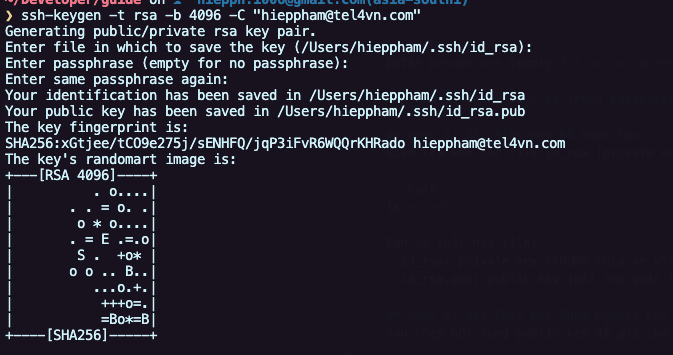

# Hướng dẫn Tạo SSH Key và Gửi cho team Infra

## Bước 1: Kiểm tra xem đã có SSH Key chưa
Mở Terminal (Linux/macOS) hoặc Command Prompt (Windows) và chạy lệnh sau để kiểm tra xem bạn đã có cặp key SSH nào chưa:

```bash
ls ~/.ssh
```

Nếu bạn thấy file như id_rsa và id_rsa.pub, nghĩa là bạn đã có key SSH. Nếu chưa, tiếp tục làm theo các bước dưới đây để tạo key SSH mới. Nếu muốn tạo để nhận dạng theo tel4vn thì cũng có thể phải tạo mới, vì file cũ có thể các bạn tạo cho các server khác.

## Bước 2: Tạo SSH Key (Nếu chưa có)
Chạy lệnh sau trong Terminal hoặc Command Prompt để tạo cặp key SSH:

```bash
ssh-keygen -t rsa -b 4096 -C "hieppham@tel4vn.com"
```
-t rsa: Chỉ định thuật toán RSA.
-b 4096: Độ dài key là 4096 bit.
-C "hieppham@tel4vn.com": Thêm email của bạn để nhận diện key.
### Lưu ý: Bạn cần thay thế "hieppham@tel4vn.com" bằng địa chỉ email của bạn.

## Bước 3: Chọn Vị Trí Lưu Trữ Key
Khi được nhắc nhập vị trí lưu key, bạn có thể nhấn Enter để sử dụng vị trí mặc định (~/.ssh/id_rsa). Nếu bạn muốn lưu ở nơi khác, nhập đường dẫn mong muốn và bạn cũng có thể dặt tên file mới khác với tên mặc định (id_rsa). Lưu ý trong trường hợp này bạn thay path và tên id_rsa bằng tên file bạn nhập

```bash
Enter file in which to save the key (/home/username/.ssh/id_rsa):
Bước 4: Đặt Passphrase
Bạn sẽ được hỏi có muốn đặt mật khẩu (passphrase) cho key không. Điều này giúp tăng cường bảo mật. Bạn cần phải nhập mật khẩu rồi nhấn Enter (mật khẩu sẽ yêu cầu nhập khi dùng key SSH).
```

```bash
Enter passphrase (empty for no passphrase):
```
### Lưu ý: Không được bỏ trống passphrase và mỗi nhân viên phải đặt khác nhau


## Bước 5: Xác Minh key Đã Được Tạo
Kiểm tra xem các file id_rsa (private key) và id_rsa.pub (public key) đã được tạo thành công hay chưa:

```bash
ls ~/.ssh
```
Bạn sẽ thấy hai file:
- id_rsa: private key (KHÔNG chia sẻ với ai).
- id_rsa.pub: public key (gửi cho team Infra).

## Bước 6: Sao Chép Nội Dung Public Key
Sao chép nội dung public key để gửi cho team Infra. Chạy lệnh sau:

```bash
cat ~/.ssh/id_rsa.pub
```
Nội dung của public key sẽ được hiển thị. Sao chép toàn bộ nội dung (bao gồm cả phần ssh-rsa và địa chỉ email ở cuối).

## Bước 7: Gửi Public Key Cho Team INFRA
Gửi nội dung public key vừa sao chép qua email cho team INFRA để họ cấp quyền SSH. 
Email gửi đến: infra@tel4vn.com với tilte email: "[INFRA][TÊN TEAM] - CẤP QUYỀN TRUY CẬP SSH".

Template email

```plaintext
TILTE: [INFRA][TÊN TEAM/ TÊN PHÒNG BAN] - CẤP QUYỀN TRUY CẬP SSH

Dear team INFRA,
Tôi là [Tên của bạn], hiện đang làm việc tại [Tên Phòng Ban, Công Ty]. 
Tôi đang cần quyền truy cập SSH vào [tên máy chủ hoặc hệ thống] để thực hiện [lý do hoặc công việc cụ thể, ví dụ: quản lý dự án, phát triển phần mềm, v.v.].
Dưới đây là thông tin SSH public key của tôi:
    ssh-rsa AAAAB3NzaC1yc2EAAAABIwAAAQEAmxj...
Nếu có thêm yêu cầu hoặc thông tin nào cần bổ sung, xin vui lòng phản hồi lại email.
Rất mong nhận được sự hỗ trợ từ team Infra.

Trân trọng.
[Tên của bạn]

```
## Lưu ý: Không bao giờ chia sẻ private key (id_rsa) với bất kỳ ai!

