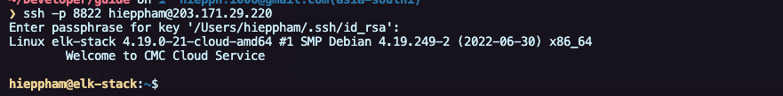

# SSH Bằng CMD với Public Key
Sau khi team INFRA đã cập nhật public key vào server, bạn có thể sử dụng SSH key để kết nối vào server.

## Kết Nối Vào Server
Sử dụng lệnh ssh để kết nối vào server

```bash
ssh -p port username@server_ip
```

Trường hợp, các bạn đặt tên file khác id_rsa or ở path khác thì cần trỏ đường dẫn vào command ssh
```bash
ssh -i {path_to_ssh_file} -p port username@server_ip
```

- port: port SSH của server
- username: Tên người dùng trên server remote.
- server_ip: Địa chỉ IP hoặc tên miền của server.
- path_to_ssh_file: Đường dẫn tới SSH private key


Sau đó nhập passphrase của key SSH đã tạo trước đó:
``` plaintext
Enter passphrase for key '/Users/username/.ssh/id_rsa':
```




## Tùy chỉnh kết nối SSH Client (Optional)

Để dễ dàng kết nối nhiều lần mà không phải nhập lệnh dài, bạn có thể cấu hình kết nối trong file ~/.ssh/config.

Mở file cấu hình với terminal:

```bash
vim ~/.ssh/config
```

Thêm cấu hình sau vào file:

```plaintext
Host elkstack
    HostName 203.171.29.220
    User hieppham
    Port 8822
    IdentityFile ~/.ssh/id_rsa
```    

- Host: Tên biệt danh cho server (bạn có thể đặt bất kỳ tên nào).
- HostName: Địa chỉ IP hoặc tên miền của server.
- Port: Port SSH của server.
- User: Tên người dùng trên server.
- IdentityFile: Đường dẫn đến private key của bạn (tệp id_rsa).

Sau khi lưu file, bạn có thể kết nối vào server bằng lệnh như bên dưới và nhập passphrase:

```bash
ssh elkstack
```
```plaintext
Enter passphrase for key '/Users/hieppham/.ssh/id_rsa':
```

