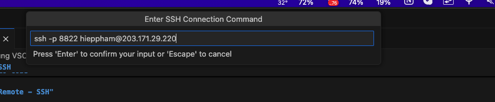
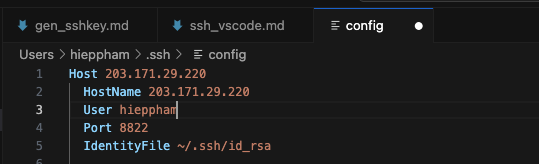
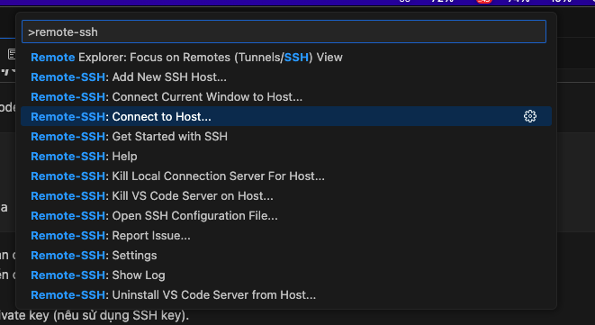
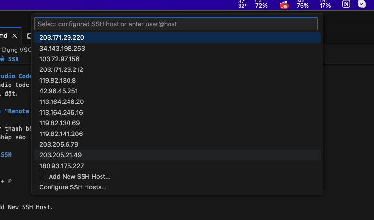

# Hướng Dẫn Sử Dụng VSCode Để SSH
Visual Studio Code hỗ trợ kết nối SSH thông qua tiện ích mở rộng (extension) để quản lý mã nguồn và làm việc trực tiếp với các server remote một cách dễ dàng.

## Bước 1: Cài Đặt Visual Studio Code
Tải về và cài đặt Visual Studio Code nếu bạn chưa có.
Khởi chạy VSCode sau khi cài đặt.

## Bước 2: Cài Đặt Extension "Remote - SSH"
Mở VSCode.
Chọn biểu tượng Extensions ở thanh bên (hoặc nhấn Ctrl + Shift + X trên Windows/Linux hoặc Cmd + Shift + X trên macOS).
Tìm kiếm "Remote - SSH" và nhấp vào Install để cài đặt.

## Bước 3: Cấu Hình Kết Nối SSH
1. Mở Command Palette:
```plaintext
Windows/Linux: Ctrl + Shift + P
macOS: Cmd + Shift + P
```
2. Gõ và chọn Remote-SSH: Add New SSH Host.

3. Nhập lệnh SSH để kết nối tới server:

```bash
ssh -p port username@server_ip
```
- port: port SSH của server
- username: Tên người dùng trên server remote.
- server_ip: Địa chỉ IP hoặc tên miền của server.



4. Chọn nơi lưu cấu hình SSH (~/.ssh/config).

## Bước 4: Cấu Hình File ~/.ssh/config
Mở file cấu hình ~/.ssh/config trong VSCode và thêm các thông tin cần thiết rồi Save lại:
Sử dụng Command Palette (Ctrl + Shift + P) on Windows hoặc (Cmd + Shift + P) on macOS to open the command palette. Sau đó nhập vào: ~/.ssh/config để mở file cấu hình SSH.

```bash
Host 203.171.29.220
    HostName server_ip
    User username
    IdentityFile ~/.ssh/id_rsa
```
- Host: Tên biệt danh cho server (bạn có thể đặt bất kỳ tên nào).
- HostName: Địa chỉ IP hoặc tên miền của server.
- User: Tên người dùng trên server.
- IdentityFile: Đường dẫn tới SSH private key (nếu sử dụng SSH key).



## Bước 5: Kết Nối Tới Server Remote
1. Mở Command Palette:
```plaintext
Windows/Linux: Ctrl + Shift + P
macOS: Cmd + Shift + P
```
2. Gõ và chọn Remote-SSH: Connect to Host.




3. Chọn server bạn đã cấu hình (ví dụ: 203.171.29.220).



4. VSCode sẽ mở một cửa sổ mới kết nối tới server remote.